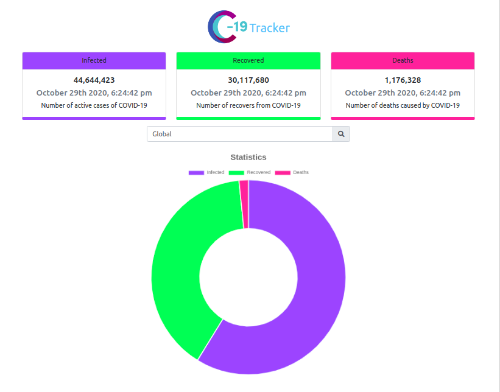

# COVID-19 Tracker

Click here to the [Live Site](https://ahmaat19covid19.herokuapp.com/)

## Available Scripts

In the project directory, you can run:

### `npm i && npm start`

Runs the app in the development mode.\
Open [http://localhost:3000](http://localhost:3000) to view it in the browser.

This project is all about live COVID-19 Update from all over the world.
